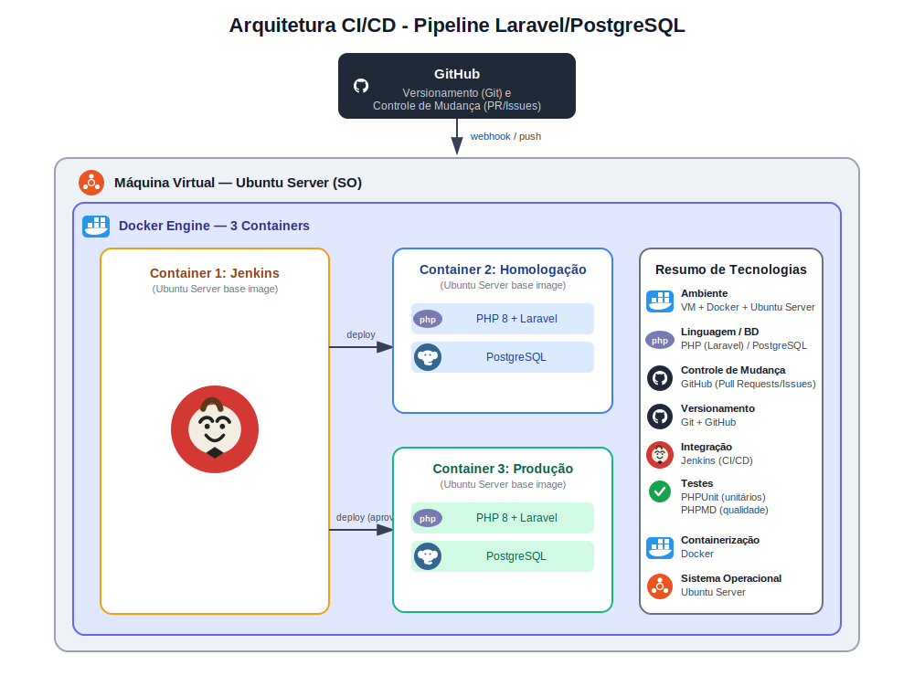

# 🚀 Pipeline CI/CD — Laravel + PostgreSQL

Pipeline de Integração e Entrega Contínua para uma aplicação **PHP/Laravel**, com banco de dados **PostgreSQL**, orquestrado via **Jenkins** e executado em **containers Docker** sobre uma **VM Ubuntu Server**.


---

## 📋 Sobre o projeto

Este repositório documenta a arquitetura e o pipeline de CI/CD configurados para automatizar o ciclo de **build → teste → análise de qualidade → deploy** de uma aplicação Laravel, desde o commit no GitHub até a disponibilização em produção.

O fluxo é todo orquestrado pelo Jenkins, que executa os testes automatizados e promove a aplicação entre os ambientes de homologação e produção.

---

## 🏗️ Arquitetura

A infraestrutura é composta por uma única **máquina virtual Ubuntu Server**, rodando **Docker Engine** com três containers isolados:



| Container | Função |
|---|---|
| **Jenkins** | Orquestra o pipeline de CI/CD (build, testes, análise, deploy) |
| **Homologação** | Ambiente de QA — PHP 8 + Laravel + PostgreSQL |
| **Produção** | Ambiente final — PHP 8 + Laravel + PostgreSQL |

---

## 🛠️ Tecnologias utilizadas

| Categoria | Tecnologia |
|---|---|
| **Ambiente** | Máquina Virtual + Docker + Ubuntu Server |
| **Linguagem** | PHP 8 (Laravel) |
| **Banco de dados** | PostgreSQL |
| **Controle de versão** | Git |
| **Controle de mudança** | GitHub (Pull Requests / Issues) |
| **Integração contínua** | Jenkins |
| **Testes automatizados** | PHPUnit |
| **Análise de qualidade de código** | PHPMD |
| **Containerização** | Docker |


## 📦 Estrutura dos containers

```
VM (Ubuntu Server)
└── Docker Engine
    ├── jenkins/         → Orquestração do pipeline CI/CD
    ├── homologacao/      → PHP 8 + Laravel + PostgreSQL
    └── producao/         → PHP 8 + Laravel + PostgreSQL
```

---


## ✅ Testes e qualidade de código

```bash
# Executar testes unitários
./vendor/bin/phpunit

# Executar análise estática de código
./vendor/bin/phpmd app/ text cleancode,codesize,controversial,design,naming,unusedcode
```

---

## 📁 Estrutura de pastas

```
.
├── app/                 # Código-fonte Laravel
├── tests/               # Testes PHPUnit
├── Jenkinsfile          # Definição do pipeline
├── docker-compose.yml   # Orquestração dos containers
├── diagrama_cicd.svg    # Diagrama da arquitetura
└── README.md
```

---
