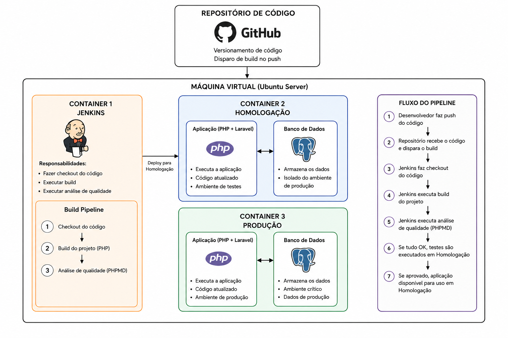

# 🚀 Pipeline CI/CD — Laravel + PostgreSQL

Pipeline de Integração e Entrega Contínua para uma aplicação **PHP/Laravel**, com banco de dados **PostgreSQL**, orquestrado via **Jenkins** e executado em **containers Docker** sobre uma **VM Ubuntu Server**.


---

## 📋 Sobre o projeto

Este projeto tem como objetivo demonstrar a implementação de um pipeline completo para automatizar o ciclo de **build → teste → análise de qualidade → deploy** para uma aplicação web desenvolvida em PHP utilizando o framework Laravel e banco de dados PostgreSQL.

A solução foi construída com foco na automação do processo de desenvolvimento, testes, validação e implantação de software, aplicando conceitos estudados na disciplina de Gerência de Configuração de Software. Para isso, foi utilizada uma infraestrutura baseada em containers Docker executados em uma máquina virtual Linux, permitindo a separação dos ambientes de homologação e produção.

O fluxo inicia com o desenvolvimento e versionamento do código-fonte através do Git e GitHub. Sempre que uma alteração é enviada ao repositório, o Jenkins pode executar automaticamente etapas de validação, incluindo análise de qualidade de código com PHPMD e execução de testes automatizados. Caso todas as verificações sejam aprovadas, o sistema é atualizado no ambiente de homologação, permitindo a validação das alterações antes de sua disponibilização em produção. A aplicação consiste em um sistema de controle financeiro, responsável pelo gerenciamento de receitas e despesas.

---

## 🏗️ Arquitetura

A infraestrutura é composta por uma única **máquina virtual Ubuntu Server**, rodando **Docker Engine** com três containers isolados:



| Container | Função |
|---|---|
| **Jenkins** | Orquestra o pipeline de CI/CD (build, testes, análise, deploy) |
| **Homologação** | Ambiente de QA — PHP 8 + Laravel + PostgreSQL |
| **Produção** | Ambiente final — PHP 8 + Laravel + PostgreSQL |

---

## 🛠️ Tecnologias utilizadas

| Categoria | Tecnologia |
|---|---|
| **Ambiente** | Máquina Virtual (Ubuntu) + Containers Docker |
| **Linguagem** | PHP 8 (Laravel) |
| **Banco de dados** | PostgreSQL |
| **Controle de versão** | Git |
| **Controle de mudança** |  Git + GitHub |
| **Integração contínua** | Jenkins |
| **Testes automatizados** | PHPUnit |
| **Análise de qualidade de código** | PHPMD |


## 📦 Estrutura dos containers

```
VM (Ubuntu Server)
└── Docker Engine
    ├── jenkins/      → Orquestração do pipeline CI/CD
    ├── homolog/      → PHP 8 + Laravel + PostgreSQL
    └── prod/         → PHP 8 + Laravel + PostgreSQL
```

---

## 🔎 Controle de Qualidade

Antes do deploy em homologação, o Jenkins executa:

- PHPMD (PHP Mess Detector)
- PHPUnit

Caso qualquer etapa falhe:

- Build interrompido
- Deploy cancelado
- Ambiente de homologação permanece inalterado

---
